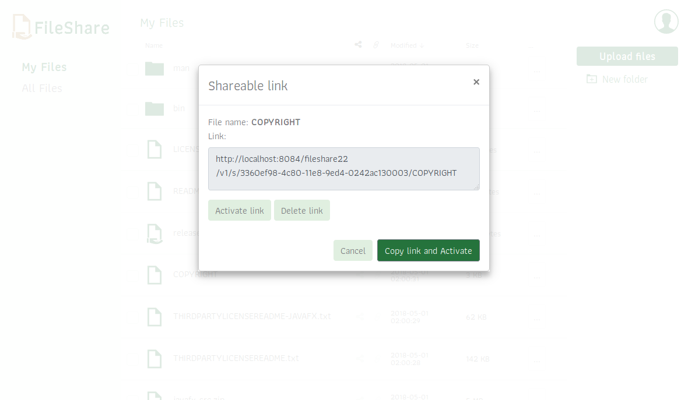

# Fileshare for SilverStripe


## Introduction
In its current form this is a centralized file sharing service for small businesses or communities.  
See future plans at the bottom of  the page.  
Under the hood it's a Silverstripe based server providing a RESTful API and a ReactJS client.

## Goals
*   creation of a file sharing service which can operate in a shared hosting environment on a typical LAMP stack where there is no possibility to modify upload_max_size, or post_max_size variables.
*   a responsive client which scales well on mobile devices

## Features
*   users can:
    *   upload one or more files via drag'n'drop or using the upload button.
    *   create folders
    *   download files
*   admins can:
    *   share files with multiple users
    *   create shareable links for files
    *   browse the users folders, act on their behalf

## Architecture
The module takes advantage of Silverstripe 4's File API to store and protect files.
As SS4 uses FlySystem in the background, filesystem abstraction should be possible - but not tested yet.  
The server can be communicated trough a RESTful API.

The client is a responsive web app based on ReactJS and Bootstrap 4.  
The upload script is resumable.js. It's not the best fit for React, immutable data structures, es6 and functional programming, but it's proven, reliable and it can create small chunks from the files before uploading, to allow pause/resume functionality and to keep upload sizes under the servers filesize limit.

## Screenshots

### Login
<!--  -->


### My files
<!--  -->


### Drag'n'drop
<!--  -->


### All files
<!--  -->


### Uploading
<!--  -->


### Shareable link dialogue
<!--  -->


### Sharing dialogue
<!--  -->


### Mobile view
<!--  -->


## installation

```
composer require "devcreative/fileshare"
```


## Usage
*   don't forget to dev/build and flush
*   optional: edit the config file: fileshare.yml  
to modify the default fileshare_folder_name. ('fileshare')
*   create a new FileSharePage.
*   add users the fileshare-user, or the fileshare-admin groups respectively


### Plans/Todo

*   From users perspective:  

    -   [ ] add some smaller missing features like:
        -   renaming folders
        -   add select/deselect all button
        -   etc
    -   [ ] selectable color themes, or a color slider
    -   [ ] make sharing folders possible
    -   [ ] allow users to create shareable links for files
    -   [ ] allow users to share files with each other (based on friendship, or predefined groups)
    -   [ ] allow admins to create user groups (share files with groups etc.)
    -   [ ] display the uploading status of each file, allow to pause and restart   (resumable.js does this, it only needs the UI)


*   From developers perspective:

    -   [ ] create API documentation
    -   [ ] create missing unit tests
    -   [ ] client: error handling and display
    -   [ ] server code needs some refactoring
    -   [ ] JWT tokens for authentication
    -   [ ] Redux for state management
    -   [ ] Apicase to organize API calls
    -   [ ] JSS for styling
